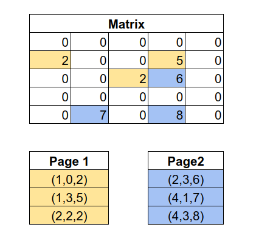

# Report Project Phase0

## Part 2: Page Layout

The matrix is broken down into different blocks and stored as pages based on the BLOCK_SIZE. So a $N \times N$ matrix will be broken into $b \times b$ pages. Lets say each block can only store $m$ rows, then the page will store a $m \times m$ submatrix of original the matrix, and any extra space left in the block will be filled with -1. We store the numbers of rows and columns in each block, and the value of -1 is only used as a filler. This allows to have a value of -1 in the matrix.


In the above figure, we have $5\times5$ matrix, and every block can store upto $3\times3$ submatrix. The pages are stored in Column Major format and page_id can be calculated based on the row_index, column_index of the matrix and the size of the blocks.

```cpp
rowBlock = row_index / maxRowsPerBlock;
colBlock = column_index / maxColsPerBlock;
pageId = (colBlock * blockCount) + rowBlock;
```

where `blockCount` is the square root of the number of blocks required to store the complete matrix.

## Part 2: CROSS_TRANSPOSE

**Steps for CROSS_TRANSPOSE:**

1. Syntactic Parser
2. Semantic Parser: checking if matrices of same size
3. Self transpose of matrix A
4. Self transpose of matrix B
5. Swapping the two matrices

**Steps for self tranpose:**  
For a matrix, we can represent all the pages of the matrix using two indices: `(rowBlock, colBlock)`. So page0 is (0, 0) and page1 is (1, 0) etc. Then we can do the transpose using the following:

1. Loop over the all the pages in a nested loop using `(rowBlock, colBlock)`.
2. if `(rowBlock < colBlock)`, then read the page`(rowBlock, colBlock)` and page(colBlock, rowBlock) into main memory, transpose each page in memory and write back in the opposite pages.
3. if `(rowBlock == colBlock)`, then transpose the page in itself and write to the same page.
4. if `(rowBlock > colBlock)`, then continue the loop.

**Steps for swapping matrices:**

1. Loop over the all the pages in a nested loop using `(rowBlock, colBlock)`. The total number of pages for both matrices will be same, because they have the same size.
2. For each `(rowBlock, colBlock)` index load the page_A of matrix A and page_B of matrix B into main memory.
3. Write the values of page_A into page_B and vice versa

# Part 3: Sparse Matrix

## Compression and storage

A sparse matrix can be defined as a matrix which have majority of the elements as 0. Lets say if the number of zeros is greater than 60%, then it will be called sparse matrix.  
To store such a matrix normally would use a lot of space which can be reduced. For this we store the non-zero values of the matrix in 3-tuple format `(row, column, value)` in sorted (ascending) order in the pages.
We can store



In the given example we are storing 3 entries in each block.

**Compression Ratio**  
Assuming the sparse matrix has total $N$ elements, and out of which $m$ are zero valued entries.
Then the sparsity of the matrix is defined as $\frac{N-m}{N}$.

-   Space required to store the marix normally = N \* sizeof(int) bytes.
-   Space required to store the marix with new method = (N-m) \* 3 \* sizeof(int) bytes.
-   So the compression ratio is: $\frac{3(N-m)\times sizeof(int)}{N\times sizeof(int)}$ = $\frac{3(N-m)}{N}$

## Transpose

To find the transpose of a sparse matrix, we just need to transpose the non-zero values. For that, we can read all the values stored as tuples `(row, column, value)` from the pages and interchange the row and column so now the tuple looks like `(column, row, value)`. These values will be sorted and then written back to the pages.

## BONUS

We implemented LOAD for sparse matrix.

1. In function `Matrix::load()`, we call extract columns which counts the dimensions of the matrix and add that to the matrix variables that maintains the same.
2. Then we check for sparse matrix using the function isSparse(), where we also set the dimensions of the block.
3. Then we blockify the matrix.
4. If the matrix is sparse then we go about all elements of the matrix, if the element is not zero then we wrote `row,column,value` to the page.

We implemented PRINT for sparse matrix.

1. We go about all the elements in the matrix dimension, at every step we check at the front row of the block, where non-zero values are stored, if the column number and row number matches the index of the matrix.
2. If yes then we print the value that is present at that index, move to the next row in the block.
3. If not then we print 0.
